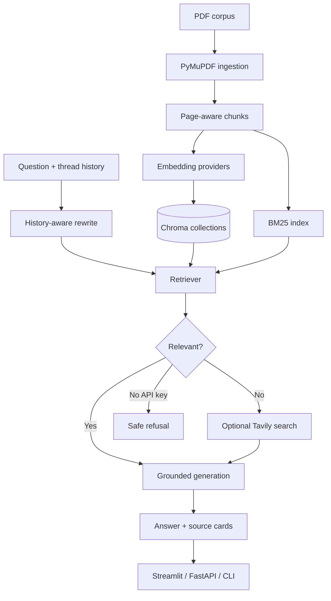

# Research Paper Answer Bot

An evidence-first RAG application over five landmark Generative AI papers: Attention Is All You Need,
GPT-4, InstructGPT, Mistral 7B, and Gemini 1.0. Every response includes citable paper/page sources.

## What is included

- Page-aware PyMuPDF ingestion and persistent Chroma indexing.
- Four embedding configurations: MiniLM, BGE-base, GTE-large, and OpenAI `text-embedding-3-small`.
- Dense, BM25, hybrid RRF, rerank, and MMR retrieval strategies with a reproducible benchmark.
- Grounded Gemini synthesis when configured; faithful local extractive fallback otherwise.
- Corrective out-of-corpus branch (Tavily when configured), thread-isolated conversation memory,
  Streamlit retrieval inspector, FastAPI, CLI, tests, and a golden QA set.

## Project scope

This capstone answers natural-language questions across five seminal Generative AI papers. It is
designed around evidence, not a single happy-path RAG demo: the project compares embedding models and
retrieval strategies, keeps page-level citations, supports multi-turn conversations, and refuses or
uses corrective search when the supplied corpus cannot support an answer.

| Area | Included |
|---|---|
| Corpus | Attention Is All You Need, GPT-4, InstructGPT, Mistral 7B, Gemini 1.0 |
| Retrieval evaluation | MiniLM, BGE-base, GTE-large, OpenAI embeddings; dense, BM25, hybrid RRF, rerank, MMR |
| Answer quality | Grounded synthesis, numbered source cards, paper/page/excerpt provenance |
| Product surfaces | Streamlit research workspace, FastAPI, interactive CLI |
| Stretch capabilities | Thread-isolated multi-turn memory and corrective web-search fallback |

## High-level product flow


The same conversation can be continued using the active thread, or reset from the Streamlit sidebar.

## Technical design



### Design decisions

- **Citations first:** every source carries the original paper title, page, excerpt, and chunk ID.
- **Measured retrieval:** `evaluation/run_benchmark.py` compares model/retriever combinations on the golden QA set and writes the results to `evaluation/results/`.
- **Local resilience:** the application works without API keys using an extractive answer path and deterministic local embedding fallback; neural and commercial providers can be enabled for the full bake-off.
- **Safe corrective behavior:** clear out-of-corpus queries route to Tavily when configured, or state the limitation instead of fabricating an answer.

## Setup

```bash
python3 -m venv venv
source venv/bin/activate
pip install -r requirements.txt
cp .env.example .env
pytest tests/ -v
```

No key is required for local ingestion, retrieval, tests, CLI, or UI. Set `GEMINI_API_KEY` for
generative synthesis, `OPENAI_API_KEY` to run the commercial embedding arm, and `TAVILY_API_KEY` for
the corrective web-search branch.

## Run all three entrypoints

Activate the virtual environment first:

```bash
cd "/path/to/Research_Paper_Capstone"
source venv/bin/activate
```

### 1. Streamlit research workspace

```bash
streamlit run entrypoints/ui.py --server.port 8501
```

Open `http://localhost:8501`. The workspace includes research chat, corpus, evaluation, and conversation-guide tabs.

### 2. FastAPI service

```bash
uvicorn entrypoints.api:app --reload --port 8000
```

Open the interactive API documentation at `http://localhost:8000/docs`, or submit a cited question:

```bash
curl -X POST http://localhost:8000/api/v1/ask \
  -H "Content-Type: application/json" \
  -d '{"query":"How does Mistral improve inference efficiency?","thread_id":"demo"}'
```

### 3. Interactive terminal CLI

```bash
python cli.py
```

Type a research question at the `You:` prompt. Type `exit` or `quit` to close the session.

### Optional: run the retrieval evaluation

```bash
python -m evaluation.run_benchmark
```

The API exposes `GET /health`, `POST /api/v1/ask`, and `GET /api/v1/sources`.

## Evaluation

`python -m evaluation.run_benchmark` builds the corpus, evaluates all configured embedding and
retrieval variants against `evaluation/golden_qa.json`, and writes Markdown tables to
`evaluation/results/`. Run it with downloaded local models/API credentials before submitting results;
the framework intentionally does not misrepresent its offline fallback as a neural embedding result.

## Presentation

The single presentation deliverable is [Research Paper Capstone Presentation](docs/Research_Paper_Capstone_Presentation.pptx).
