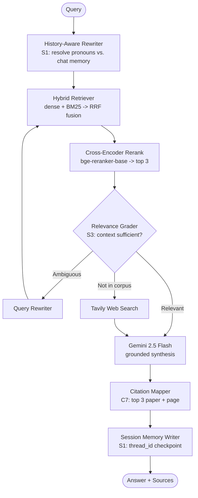

# Research Paper Answer Bot — Project Plan

**Analytics Vidhya · GenAI Pinnacle Program — Capstone Project 2**
*Author:* Dinesh Shankar
*Planned:* 2026-09-06

This plan follows the same three-stage cadence used for Capstone 1 (ShopUNow Agentic AI Assistant):
**(1) Scope → (2) Tech Stack & Design → (3) Implementation.**

---

## Stage 1 — Scope

### 1.1 Business Case

We are building for an ArXiv-like organization that hosts seminal AI research. The deliverable is an
intelligent answer bot that lets a researcher ask natural-language questions across a corpus of
landmark Generative AI papers and receive a grounded, citation-backed answer.

The graded emphasis is **not** "a RAG pipeline exists." It is: *every component was explored across
multiple approaches, measured, and the winner was chosen on evidence.* The plan is therefore built
around a bake-off harness, not a single happy path.

### 1.2 Corpus (already downloaded — `papers/`)

| Paper | File | Size | Why it matters |
|---|---|---|---|
| Attention Is All You Need | `attention_paper.pdf` | 2.2 MB | Transformer architecture |
| GPT-4 Technical Report | `gpt4.pdf` | 0.7 MB | Frontier model capabilities & evals |
| InstructGPT (Training LMs to follow instructions) | `instructgpt.pdf` | 0.8 MB | RLHF / alignment |
| Mistral 7B | `mistral_paper.pdf` | 3.3 MB | Efficient open models, GQA/SWA |
| Gemini 1.0 Technical Report | `gemini_paper.pdf` | 14.8 MB | Multimodal, long context |

5 PDFs, ~200 pages total. Expected ~1,200–1,800 chunks at 512 tokens. Small enough that the full
embedding × retrieval bake-off is cheap to run end to end.

### 1.3 Goal Coverage

**Compulsory (all 7):**

| # | Requirement | How we satisfy it |
|---|---|---|
| C1 | Get dataset / download PDFs | Done — 5 papers in `papers/` |
| C2 | Load files and index in a vector DB | PyMuPDF parse → chunking → ChromaDB (persistent) |
| C3 | Experiment with embedding models (HF open-source **and** commercial) | 4-way bake-off: `all-MiniLM-L6-v2`, `bge-base-en-v1.5`, `gte-large`, `text-embedding-3-small` |
| C4 | Experiment with retrieval strategies (cosine → hybrid → rerankers) | 5-way bake-off: dense cosine, BM25, hybrid RRF, hybrid + cross-encoder rerank, MMR |
| C5 | Connect vector DB to an LLM, build RAG pipeline | LangGraph pipeline, Gemini 2.5 Flash synthesis |
| C6 | Test on sample queries | 30-question golden set + qualitative demo queries |
| C7 | Show sources of the generated response (top 3) | Inline `[1][2][3]` citations mapped to paper + page + chunk, rendered in UI and API payload |

**Stretch (all 3 — guide requires ≥1):**

- **S1 · Multi-user conversational RAG** — history-aware query rewriting + per-`thread_id` memory, so
  "what about *its* context window?" resolves against the prior turn. Concurrent sessions stay isolated.
- **S2 · Streamlit application** — chat UI with a live **Retrieval Inspector** (which chunks were pulled,
  their scores, pre- and post-rerank), source cards, and per-answer latency/token telemetry.
- **S3 · Agentic Corrective RAG** — a LangGraph grader node scores retrieved context for relevance;
  on failure it rewrites the query and falls back to Tavily web search rather than hallucinating.

### 1.4 Out of Scope

Fine-tuning; multimodal/figure-and-table extraction from the PDFs; hosted cloud deployment; auth;
corpus expansion beyond the 5 provided papers.

### 1.5 Definition of Done

- `pytest tests/ -v` green.
- `python -m evaluation.run_benchmark` produces the full embedding × retrieval comparison table.
- Streamlit app answers a cross-paper question with correct, clickable citations.
- A deliberately out-of-corpus question (e.g. "What is DeepSeek-R1's training recipe?") triggers the
  corrective web-search branch instead of a fabricated answer.
- `docs/DESIGN_DOC.md`, `README.md`, presentation deck, and Colab workbook all complete.

---

## Stage 2 — Tech Stack & Design

### 2.1 Stack

| Layer | Choice | Rationale |
|---|---|---|
| Orchestration | **LangGraph** + LangChain | Consistent with Capstone 1; corrective-RAG loop needs conditional edges |
| PDF parsing | **PyMuPDF** (`fitz`) | Fast, keeps page numbers — required for citations. Fallback: `unstructured` for the messier Gemini report |
| Chunking | `RecursiveCharacterTextSplitter` (512/64) as baseline; section-aware splitter as challenger | Bake-off candidate |
| Vector store | **ChromaDB** (persistent, local) | Same as Capstone 1; multiple named collections, one per embedding model |
| Lexical index | **`rank_bm25`** | Powers hybrid retrieval |
| Embeddings (open) | `all-MiniLM-L6-v2`, `BAAI/bge-base-en-v1.5`, `thenlper/gte-large` | HF requirement; spans 384→1024 dims and speed/quality tiers |
| Embeddings (commercial) | `text-embedding-3-small` (OpenAI) | Commercial requirement |
| Reranker | `BAAI/bge-reranker-base` cross-encoder | Local, no API cost |
| Generation | **Gemini 2.5 Flash** | Same as Capstone 1; free tier, long context |
| Web search | **Tavily** | Corrective-RAG fallback (S3) |
| Evaluation | Custom harness: Hit Rate@k, MRR, nDCG@5, latency + RAGAS-style faithfulness/relevancy (LLM-judged) | Produces the evidence for "chose what works best" |
| UI | **Streamlit** | S2 |
| API | **FastAPI** | Parity with Capstone 1's entrypoint set |
| Config | `python-dotenv` + `config/settings.py` | Matches Capstone 1 convention |

**Cost note:** only OpenAI embeddings (one-time, ~1,500 chunks ≈ $0.01), Gemini generation (free tier),
and Tavily (1,000 free calls/mo) touch a paid API. Everything else runs locally.

### 2.1.1 Embedding Strategy: Local-First

C3 requires *both* open-source HF and commercial embeddings, so both get built regardless. The open
question is which one wins the bake-off and ships as the production default. **We expect the local
model to win, and we design for that.**

Rationale:

- **Quality parity.** On retrieval benchmarks `bge-base-en-v1.5` (440 MB) roughly matches or beats
  `text-embedding-3-small`. There is no quality tax for going local — the open models closed the gap.
  The bake-off settles it on *our* corpus, which is the point.
- **Demo resilience.** Same philosophy as Capstone 1's hermetic mode: a prebuilt Chroma index plus
  local weights means the walkthrough cannot be broken by bad wifi or an expired key.
- **Query latency.** ~10 ms to embed a query on MPS once the model is resident, vs. ~150–300 ms for an
  API round trip. Local is faster per query.
- **Reproducibility.** Pinned weights give identical vectors indefinitely; hosted endpoints get
  reversioned and deprecated.
- Cost is *not* a deciding factor in either direction — the entire OpenAI side is ~1.5 cents.

Costs we accept: a one-time ~2.5 GB torch install, ~500 MB of weights, a 2–5 s model load on app cold
start, and ~1.5 GB RSS if `gte-large` is served. All comfortable on the target machine (Apple M3 Pro,
18 GB). Embedding ~1,500 chunks with `bge-base` should take well under a minute.

**Note — this is not Capstone 1's `LocalHashedEmbeddingFunction`.** That was token feature hashing with
no semantic understanding, which worked only because the FAQ corpus had near-verbatim question
matching. It would fail on this corpus, where a query like "how does Mistral reduce inference memory?"
must match text saying "grouped-query attention" with zero token overlap. These are real neural
embedding models.

### 2.2 Architecture

Hexagonal (Ports & Adapters), same as Capstone 1:

```
core/        ingestion, embeddings, retrievers, graph, nodes, schema, prompts, telemetry
evaluation/  golden QA set + benchmark harness + results
entrypoints/ streamlit ui | fastapi api | cli
config/      settings, model registry
```

### 2.3 Pipeline Flow



A rewrite counter caps the corrective loop at 2 passes so it cannot spin.

### 2.4 The Bake-Off Matrix (the heart of the project)

**Dimension A — Embeddings** (fixed retriever = dense cosine, k=5):
4 models × {Hit Rate@5, MRR, nDCG@5, index time, query latency, dimensionality}.

**Dimension B — Retrieval** (fixed embedding = Dimension A winner):

1. Dense cosine (baseline)
2. BM25 lexical only
3. Hybrid — RRF fusion of dense + BM25
4. Hybrid + cross-encoder rerank
5. MMR (diversity-aware)

Scored on the same metrics plus LLM-judged faithfulness and answer relevancy on the final answer.

**Dimension C — Chunking** (secondary): 256 / 384 / 512 token windows on the winning config.

> **Why the ceiling is 512, not 1024.** All three HF models (`all-MiniLM-L6-v2`, `bge-base-en-v1.5`,
> `gte-large`) have a hard 512-token input limit. Feeding them 1024-token chunks makes
> sentence-transformers silently truncate to 512 — the back half of every chunk becomes invisible to
> retrieval while still being passed to the LLM as context. The benchmark would produce
> plausible-looking numbers that mean nothing. OpenAI's model accepts 8191 tokens and would *not*
> truncate, which makes any 1024-token comparison apples-to-oranges as well. We cap the sweep at 512
> so every cell in the matrix is measuring the same thing.

Output is `evaluation/results/` — three markdown tables plus charts that go straight into the deck.

### 2.5 Golden QA Set (~30 questions)

Hand-authored from the papers, each with a ground-truth source chunk so retrieval metrics are computable:

- **Factual single-hop (12)** — "What are the two sub-layers in each Transformer encoder layer?"
- **Cross-paper comparative (8)** — "How does Mistral 7B's attention differ from the original Transformer's?"
- **Conceptual / synthesis (6)** — "Explain how RLHF in InstructGPT changes model behaviour."
- **Out-of-corpus negatives (4)** — must trigger the corrective branch, not a hallucinated answer.

### 2.6 Directory Layout

```text
Research_Paper_Capstone/
├── config/
│   ├── __init__.py
│   └── settings.py              # paths, model registry, chunking + top-k params
├── core/
│   ├── ingestion.py             # PyMuPDF parse -> page-aware chunks
│   ├── embeddings.py            # pluggable embedding provider registry
│   ├── vector_store.py          # ChromaDB collections (one per embedding model)
│   ├── retrievers.py            # dense | bm25 | hybrid-RRF | rerank | mmr
│   ├── graph.py                 # LangGraph assembly + MemorySaver
│   ├── nodes/
│   │   ├── rewrite_node.py      # history-aware query rewriting (S1)
│   │   ├── retrieve_node.py
│   │   ├── grade_node.py        # corrective relevance grader (S3)
│   │   ├── websearch_node.py    # Tavily fallback (S3)
│   │   └── generate_node.py     # grounded synthesis + citations (C7)
│   ├── schema.py                # Pydantic models + RAGState
│   ├── prompts.py
│   └── telemetry.py
├── evaluation/
│   ├── golden_qa.json           # 30 QA pairs w/ ground-truth sources
│   ├── metrics.py               # hit rate, MRR, nDCG, faithfulness
│   ├── run_benchmark.py         # full embedding x retrieval sweep
│   └── results/                 # generated tables + charts
├── entrypoints/
│   ├── ui.py                    # Streamlit app (S2)
│   ├── ui_components.py         # chat, source cards, retrieval inspector
│   ├── api.py                   # FastAPI /api/v1/ask, /api/v1/sources
│   └── cli.py
├── notebooks/
│   └── Research_Paper_RAG_Workbook.ipynb   # Colab walkthrough
├── tests/
│   ├── test_ingestion.py
│   ├── test_retrievers.py
│   ├── test_graph.py
│   └── test_citations.py
├── papers/                      # 5 source PDFs (present)
├── data/chroma_db/              # persisted indices
├── docs/
│   ├── PROJECT_PLAN.md          # this file
│   ├── CAPSTONE_REQUIREMENTS.md
│   ├── DESIGN_DOC.md
│   └── presentation deck
├── .env.example
├── requirements.txt
└── README.md
```

---

## Stage 3 — Implementation

Ten phases. Each ends in something runnable and verifiable — no phase leaves the repo broken.

### Phase 1 — Project Skeleton
Directory tree, `config/settings.py` with the model registry, `requirements.txt`, `.env.example`,
`.gitignore`, `pytest.ini`. **Also: `git init` a dedicated repo here** (see Risks).
*Verify:* `python -c "import config.settings"` clean.

### Phase 2 — Ingestion (C2)
PyMuPDF parse preserving `{paper_id, title, page, section}` per chunk; header/footer and
reference-section stripping; recursive splitter at 512/64.
*Verify:* chunk-count report per paper; spot-check 5 chunks retain correct page numbers.

### Phase 3 — Embedding Registry + Indexing (C3)
Uniform `EmbeddingProvider` interface over the 3 HF models + OpenAI. Each provider owns its own
query prefix, document prefix, normalization policy, and `max_seq_length` — so call sites can never
get it wrong. Build one Chroma collection per model. Record index build time and dimensionality.
*Verify:* 4 collections exist with matching document counts; prefix/normalization unit test passes;
ingestion refuses chunks exceeding any model's sequence limit.

### Phase 4 — Golden QA Set
Author the 30 questions with ground-truth `(paper, page)` labels by reading the papers directly.
*Verify:* every ground-truth label resolves to a real chunk id in the index.

### Phase 5 — Retrieval Strategies (C4)
Implement the 5 retrievers behind one `Retriever` protocol so they are swappable in the benchmark
and in the graph.
*Verify:* unit tests per strategy on a fixed query with asserted top-1.

### Phase 6 — Benchmark Harness → **Decision Point**
Run Dimension A, then B, then C. Write results to `evaluation/results/`.
*Verify:* three comparison tables produced; **lock the winning config into `settings.py`** and record
the rationale in `DESIGN_DOC.md`.

### Phase 7 — Core RAG Pipeline (C5, C6, C7)
LangGraph assembly with retrieve → generate → cite. Prompt engineered for strict grounding
("answer only from context; say so if absent") with inline `[n]` markers mapped to the top-3 sources.
*Verify:* 10 sample queries answered with correct citations; refusal on an unanswerable question.

### Phase 8 — Stretch Goals
- **S3 · Corrective RAG** — grader node, rewrite loop (max 2), Tavily fallback, provenance flag
  distinguishing corpus answers from web answers.
- **S1 · Conversational memory** — history-aware rewriter + `MemorySaver`; concurrency test with two
  interleaved `thread_id`s.
- **S2 · Streamlit app** — chat, source cards, retrieval inspector, latency panel.

*Verify:* out-of-corpus query hits web search; follow-up pronoun question resolves; UI renders sources.

### Phase 9 — Tests, API, CLI
Pytest suite across ingestion / retrieval / graph / citations; FastAPI `/api/v1/ask` returning answer +
structured sources; CLI for terminal use.
*Verify:* `pytest tests/ -v` green; `curl` against the API returns cited JSON.

### Phase 10 — Deliverables
`README.md` (setup, run, results tables), `DESIGN_DOC.md`, Colab workbook, presentation deck,
final walkthrough.

### Suggested Sequencing (2-week project)

| Days | Phases |
|---|---|
| 1–2 | 1, 2 — skeleton + ingestion |
| 3–4 | 3, 4 — embeddings indexed + golden QA set |
| 5–6 | 5, 6 — retrieval strategies + benchmark → **config locked** |
| 7–8 | 7 — core RAG with citations |
| 9–11 | 8 — three stretch goals |
| 12–13 | 9 — tests, API, CLI |
| 14 | 10 — docs, workbook, deck |

---

## Risks & Mitigations

| Risk | Mitigation |
|---|---|
| **Repo hygiene** — this folder sits inside the `/Users/dinesh/1Tech` git repo, which currently has ~14,700 staged files including `dbt-env/`. Capstone 1 has its own nested `.git`. | Run `git init` inside `Research_Paper_Capstone/` in Phase 1 so the submission is a clean, self-contained repo, mirroring Capstone 1. |
| Gemini PDF (14.8 MB) has dense multi-column layout and large appendix tables | PyMuPDF with a column-aware extraction pass; drop appendix/reference sections; validate chunk readability before indexing |
| HF model downloads are slow / offline on demo day | Cache models under `~/.cache/huggingface`, commit a `scripts/warm_cache.py`; ship a prebuilt Chroma index so the demo never needs a download |
| Golden QA labelling is the most manual step | Draft candidates from paper section headers, then verify each against the retrieved chunk — cuts authoring time roughly in half |
| Benchmark API spend | OpenAI embeddings run **once** and are cached; LLM-judged metrics use Gemini free tier with results cached to disk |
| Corrective-RAG loop spins | Hard rewrite cap of 2, enforced in state and unit-tested |
| **Silent embedding misconfiguration** — `bge` models need the prefix `"Represent this sentence for searching relevant passages: "` on **queries only** (never documents), plus L2-normalized vectors for cosine. Omitting it costs several points of accuracy and looks like the *model* underperforming rather than a config bug. | Encode the prefix + normalization policy per-model in the `EmbeddingProvider` registry, not at call sites. Unit-test that a known query/document pair scores above a floor. |
| Chunk sizes above 512 tokens silently truncate on all three HF models | Dimension C capped at 512; ingestion asserts `chunk_tokens <= model.max_seq_length` and fails loudly rather than truncating |
